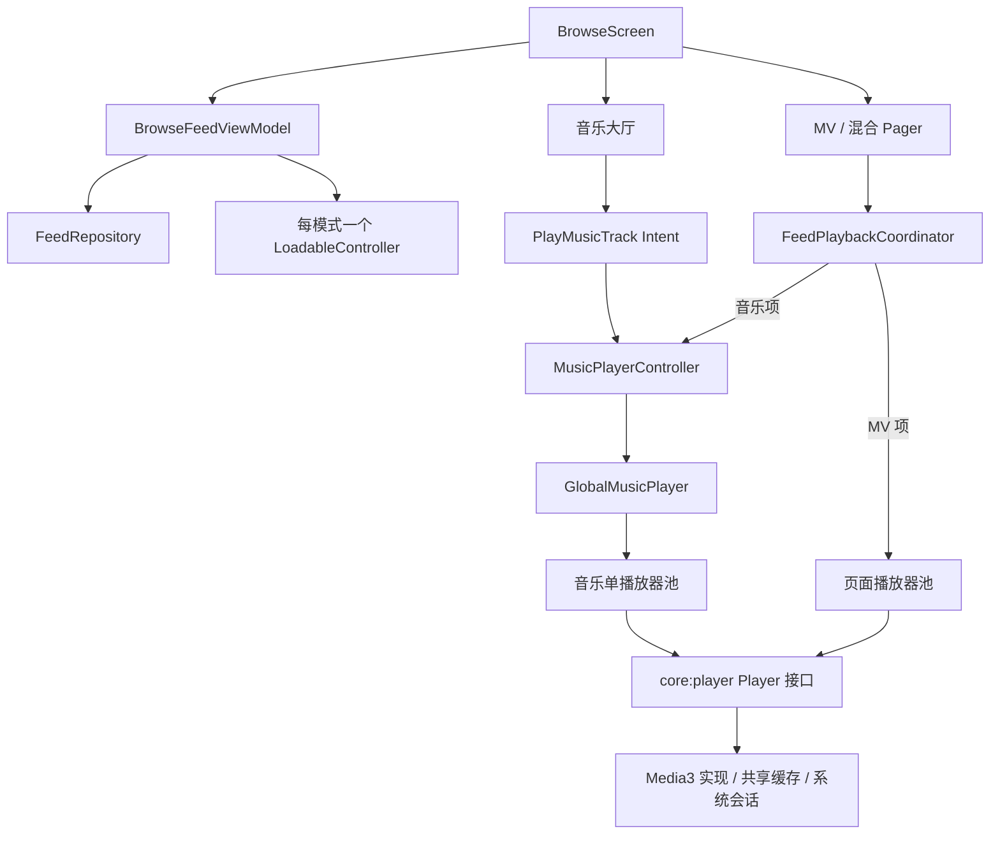

# Browse：音乐、MV 与混合流

本模块负责列表、页面、音乐队列和 Feed 播放调度。底层播放、缓存、Surface 和系统会话由 [core:player](../../core/player/README.md) 实现。

目前音乐模式是可分页的音乐大厅；MV 和混合模式使用 VerticalPager。三种模式共用数据与互动逻辑，不复制三套播放器。入口保持 BrowseRoute.Main。

## 整体调用关系



app 的 PlayerModule 将 Media3PlayerFactory 作为单例 PlayerFactory 注入，同时提供公共 HTTP 客户端、IO 调度器和 MediaSessionOwner。Browse 不直接引用 androidx.media3 类型。

MusicPlayerController 接口位于 core:data，实现 GlobalMusicPlayer 位于本 Feature；app 的迷你播放器通过该接口控制音乐。MusicPlayerModule 使用进程级 Main.immediate 协程作用域，页面退出不会取消全局音乐。

## 音乐怎样使用 core:player

1. 音乐大厅把加载到的 FeedItem 映射为 MusicTrack，点击后发送 PlayMusicTrack Intent。
2. BrowseFeedViewModel 调用 MusicPlayerController.playTrack(track, queue)。
3. GlobalMusicPlayer 更新队列和当前索引，取消上一首的任务并归还播放器。
4. 通过 PlayerFactory.createPool(1) 创建或复用单播放器池。
5. 将 MusicTrack 映射为 MediaSource：id、url、标题、作者、封面及 AUDIO 类型。
6. acquire(..., PlaybackOptions(backgroundPlayback = true)) 预备媒体，再按当前 wantsPlay 调用 setPlaying。
7. 收集 Player.state，并在播放时每 250ms 读取 position，生成 MusicPlaybackSnapshot。

对应的核心调用：

```kotlin
val pool = factory.createPool(1)
val player = pool.acquire(
    source = mediaSource,
    options = PlaybackOptions(backgroundPlayback = true),
)
player.setPlaying(true)
```

这是调用方式示例；实际实现会检查请求代次、取消任务并管理归还，不能在 Composable 每次重组时创建池。

队列的上一首、下一首、单曲循环和列表模式由 GlobalMusicPlayer / MusicQueue 处理。音乐播放器本身不启用 repeatOne：收到 ended 后，由队列决定 Seek 回开头或播放下一首。clearQueue 会取消任务、归还播放器并释放池。

音乐大厅只收集 trackId 和 isPlaying，不订阅每 250ms 更新的完整进度。迷你播放器和混合 Feed 中的音乐项使用同一个全局音乐播放器，不另建音频实例。

## MV 怎样使用 core:player

1. FeedPagerRoute 从 BrowsePlaybackViewModel 获取页面会话，绑定可见性和生命周期。
2. ObserveFeedPager 在滚动停止后用 settledPage 选播；targetPage 等信息交给 FeedPlaybackPolicy 决定预备项。
3. FeedPlaybackCoordinator 选中 MV 项时交给 MvPlaybackController，由 FeedMediaSource 将 FeedItem 映射为通用 MediaSource，MV 使用 VIDEO 类型和视频地址。
4. 页面池通常容量为 2：当前项与一个预备项。低内存设备或解码失败后降为 1。
5. acquire(source, position, PlaybackOptions(repeatOne = true)) 预备单条循环视频，不开启后台播放。
6. 当前项满足页面可见、主要可见和 wantsPlay 时，先暂停全局音乐，再调用 Player.setPlaying(true)。
7. Player.video 放入 outputs[key]，页面通过 VideoOutput.Render 显示画面。

```kotlin
val pool = factory.createPool(capacity = 2)
val player = pool.acquire(
    source = mediaSource,
    positionMs = savedPosition,
    options = PlaybackOptions(repeatOne = true),
)
```

页面通过 PlaybackCommands 执行 toggle、seekTo、retry，不接触池和 ExoPlayer。只有会话申请或归还播放器；Pager 预组合的相邻页面只读取输出接口。

FeedVideoPlayerSurface 根据方向字段预留比例，再使用 VideoOutput.aspectRatio 校正，完整显示视频。封面由 covered 控制，不能用 READY 或 outputVersion 代替首帧判断。背景加载小尺寸封面，不逐帧模糊视频。

MV 离屏立即暂停，后台停留 10 秒后释放池；退出 Composition 时 close 立即归还。重新进入时可重新绑定会话，通过书签恢复。进度、缓冲提示分别更新：进度间隔 250ms，缓冲提示延迟 300ms。

## 混合流与状态归属

混合流使用同一个 Pager。选中音乐项时，会话释放 MV 池，将音乐交给 GlobalMusicPlayer，再把全局音乐状态转换为 Feed 状态；选中 MV 时取消音乐观察，重新使用页面池。

| 状态 / 资源 | 管理者 | 生命周期 |
| --- | --- | --- |
| 模式、分页、列表、互动 | BrowseFeedViewModel | 导航 Entry |
| 播放书签 | SavedStateHandle | 可恢复的轻量数据 |
| Pager / 音乐列表滚动位置 | Compose 状态 | 页面及其状态保存范围 |
| MV 借用记录、预备方向、播放意图 | FeedPlaybackCoordinator / MvPlaybackController | 页面播放会话 |
| 音乐队列与音乐播放器 | GlobalMusicPlayer | 进程 |
| ExoPlayer、Surface、缓存、系统会话 | core:player | 按池、输出和单例分别管理 |

书签保存作品 key、列表索引、毫秒位置与播放意图，不保存 Player 或媒体地址。恢复时先找 key，必要时加载后续页；刷新成功通过 revision 重置到首项，失败保留旧列表。追加失败可重试，数据集有限，不制造无限重复项。

音乐实际作品 ID 变化时，ObserveFeedPager 会暂存全局切歌目标，滚动落定后再同步到对应页面；MV 起播与滑动中断通过暂停原因区分恢复。这些路径有 JVM 单测覆盖，但未做设备逐项验收，不能理解为所有切换场景已验证。

## UI 文件如何组织

源码前缀：`src/main/kotlin/com/lyf/composescaffold/feature/browse/`。

| 文件 | 职责 |
| --- | --- |
| presentation/BrowseScreen.kt | 公共主题、Header、模式路由和音乐大厅状态绑定 |
| presentation/FeedPagerRoute.kt | 会话装配、恢复位置、封面预取 |
| presentation/FeedPlaybackLifecycleBridge.kt | 页面可见性、生命周期和屏幕常亮 |
| presentation/ObserveFeedPager.kt | 滚动观察、选播、预备和音乐页面同步 |
| presentation/FeedPager.kt | Pager 页面、稳定 key 和拖动互斥 |
| presentation/FeedItemContent.kt | 按层装配背景、媒体内容、互动、信息和错误遮罩 |
| presentation/FeedItemChrome.kt | 音乐和 MV 共用的互动按钮、作品信息与播控装配 |
| presentation/FeedMusicHallContent.kt | 音乐大厅分页列表、标题和曲目行 |
| presentation/FeedMusicHallArtwork.kt | 音乐大厅推荐卡与绘制 |
| presentation/components/FeedMusicVinylCard.kt | 混合流音乐项的黑胶和歌词布局 |
| presentation/components/VinylDisc.kt | 黑胶绘制与旋转动画 |
| presentation/components/LyricPreview.kt | 真实时间轴高亮或静态歌词展示 |
| presentation/components/FeedPlaybackControls.kt | 活跃作品的进度订阅和操作按钮 |
| presentation/components/FeedVideoPlayerSurface.kt | 视频尺寸、Surface 与首帧封面 |

保留有布局意义的 Box、Row、Column；不为减少括号给每一行创建组件。跨音乐/MV 复用的内容或独立的绘制、动画、副作用才拆分。组件保持 internal/private，通过状态和回调连接，不增加 UI 接口工厂或转发 UseCase。

黑胶旋转在 graphicsLayer 中读取动画值，避免为旋转每帧重组组件。歌词进度只由活跃项订阅；只有真实时间轴才高亮，没有时间戳就静态显示。

## 阅读与修改顺序

先读 BrowseScreen → FeedPagerRoute / FeedMusicHallContent，再读 playback → FeedPlaybackCoordinator / MvPlaybackController / GlobalMusicPlayer。只有修改底层播放能力时才进入 core:player。

- 改列表与分页：BrowseFeedViewModel、FeedRepository、LoadableController。
- 改音乐队列：GlobalMusicPlayer 和 MusicQueue。
- 改预备策略：FeedPlaybackPolicy 与 MvPlaybackController。
- 改播放按钮：PlaybackCommands 与 FeedPlaybackControls，共用 core:design 的 MediaSeekBar。
- 改视频画面：FeedVideoPlayerSurface；不要从 UI 自行申请 Player。

## 资源与验证边界

MV 池最多 2 个，音乐另有 1 个池；池容量不等于进程总实例数。两条路径共享工厂与 256 MiB LRU 缓存。缓冲时间和字节数是目标，不代表进程内存上限。音乐允许后台播放，MV 按页面生命周期暂停。

本轮只执行 git diff --check，不运行构建、单测、设备或性能测量。现有测试包含分页、会话、队列与播放意图的替身验证，但不证明真实通知、Surface、手势或性能正确。采样信息见 [Feed 数据说明](../../docs/feed.md)。
